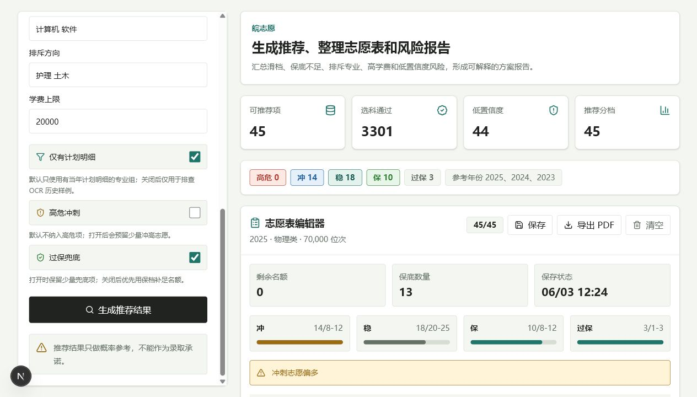
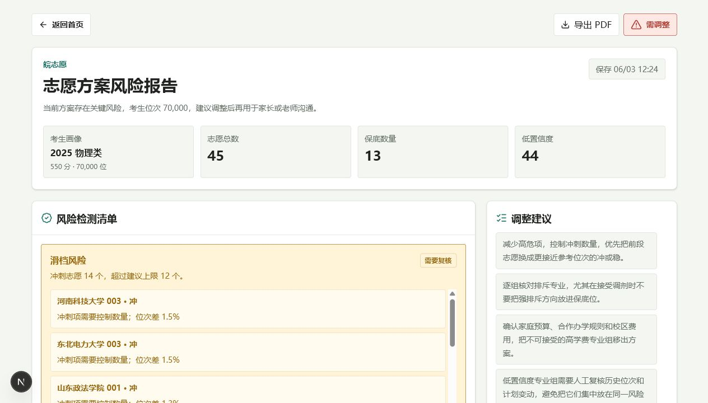

# 皖志愿

面向安徽普通类本科批考生的志愿填报辅助工具。用户输入选科、分数、位次和偏好后，系统基于安徽公开数据、历史投档位次、招生计划和选科要求，生成院校专业组推荐、冲稳保分档、风险提示、志愿表和方案报告。

> 推荐结果只用于辅助分析，不构成录取承诺。最终填报必须以安徽省教育招生考试院和高校招生章程的最新信息为准。

## 在线体验

- 线上地址：https://gaokao-volunteer-assistant.vercel.app
- 本地应用目录：`gaokao-volunteer-assistant`

## 界面预览





## 核心功能

- 安徽普通类本科批考生画像：年份、首选科目、再选科目、分数、位次和偏好。
- 一分一段校验：检查分数和位次是否匹配。
- 硬规则过滤：按批次、科类、选科要求和招生计划过滤候选专业组。
- 冲稳保推荐：基于历史位次、招生计划变化、位次波动和偏好评分生成推荐。
- 风险提示：识别高危冲刺、保底不足、低置信度、高学费和排斥专业方向。
- 志愿表编辑：支持加入、删除、排序、45 个院校专业组上限和本地保存。
- 方案报告：生成风险检测清单、调整建议和 PDF 报告。
- 响应式界面：适配桌面端和移动端浏览。

## 数据口径

- 省份：安徽
- 批次：普通类本科批
- 推荐单位：院校专业组
- 主要数据：2024-2025 改革后专业组口径数据
- 补充参考：2023 改革前文理科院校级投档位次
- 当前 cleaned CSV 规模：
  - 招生计划：47,401 条
  - 投档结果：10,758 条
  - 院校专业组：11,542 条
  - 专业：20,455 条

项目保留来源索引、清洗脚本和数据校验脚本。根目录 `data/` 是本机资料池，默认不随 Git 上传。

## 技术栈

- Next.js + React + TypeScript
- Tailwind CSS
- PostgreSQL + Prisma
- Python 数据清洗脚本
- PDFKit
- Vercel + Neon PostgreSQL

## 项目结构

```text
.
├── gaokao-volunteer-assistant/   # Next.js 应用
│   ├── src/app/                  # 页面和 API Route
│   ├── src/components/           # 前端业务组件
│   ├── src/lib/                  # 推荐、规则、报告、导入逻辑
│   ├── data/                     # cleaned CSV、来源索引和脚本
│   ├── prisma/                   # Prisma schema 和迁移
│   ├── tests/                    # 规则、数据、推荐和回测测试
│   ├── docs/                     # 项目文档
│   └── artifacts/                # 演示截图
├── project-progress/             # 进度记录
└── start-gaokao-assistant.bat    # Windows 本地启动入口
```

## 本地启动

```bash
cd gaokao-volunteer-assistant
npm install
cp .env.example .env
npm run db:ensure-local
npm run dev
```

打开 http://localhost:3000。

Windows PowerShell 可用：

```powershell
Copy-Item .env.example .env
```

如果已经配置好本机 PostgreSQL，也可以直接双击根目录的 `start-gaokao-assistant.bat` 启动。

## 常用命令

```bash
npm run check
npm run verify:data
npm run test:week10
npm run verify:week10
npm run build
```

其中 `verify:week10` 会串联 lint、Prisma schema 校验、CSV 校验、核心规则测试、推荐测试、风险报告测试、生产构建和 2024 预测 2025 回测。

## 回测结果

当前回测使用 2024 专业组线和 2023 旧文理科院校线预测 2025 实际投档线，并严格使用院校名称快照隔离跨年代码复用。

| 样本 | 可比组数 | 中位绝对误差 | 20% 内 | 30% 内 |
| --- | ---: | ---: | ---: | ---: |
| 物理类 | 141 | 9.1% | 80.9% | 87.9% |
| 历史类 | 91 | 7.1% | 83.5% | 91.2% |
| 合计 | 232 | 8.3% | 81.9% | 89.2% |

## 部署

推荐部署形态：

```text
Vercel
  -> Next.js 页面和 API Route
Neon PostgreSQL
  -> Prisma 迁移和 cleaned CSV 数据
```

生产环境变量：

```bash
DATABASE_URL="Neon pooled connection string"
NEXT_PUBLIC_DATA_VERSION="prod-anhui-data"
```

部署前执行：

```bash
npm run db:deploy
npm run data:validate
npm run data:import
npm run build
```

## 后续方向

- 导入 2026 当年正式招生计划。
- 结构化招生章程中的体检、语种、单科成绩和校区限制。
- 增加服务端方案保存、分享链接和多方案对比。
- 增加更多回测样本和阈值校准报告。
- 评估国内低成本部署方案。
